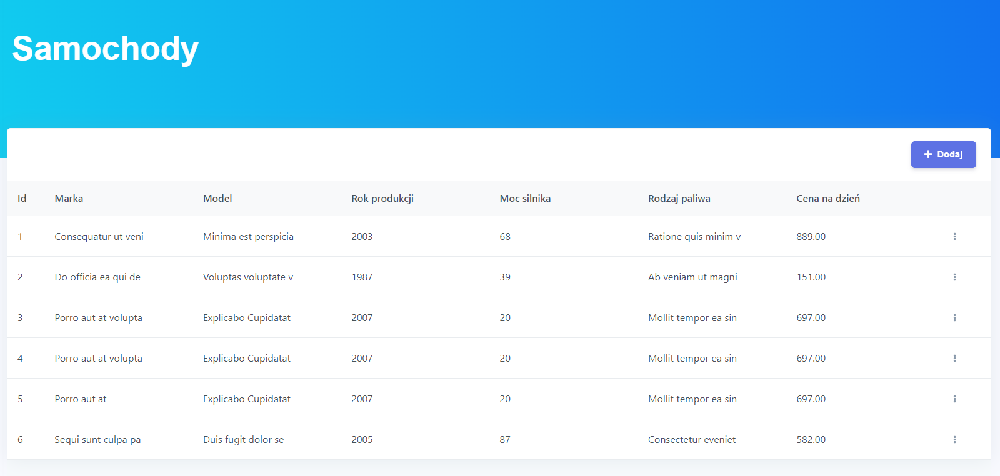
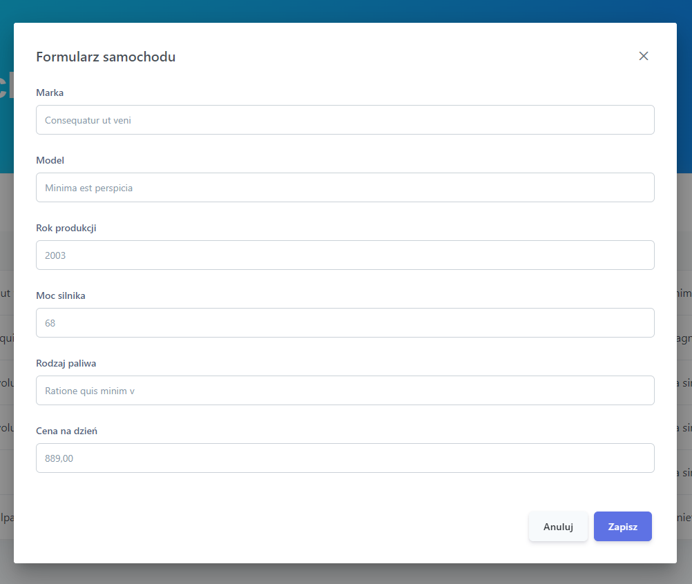
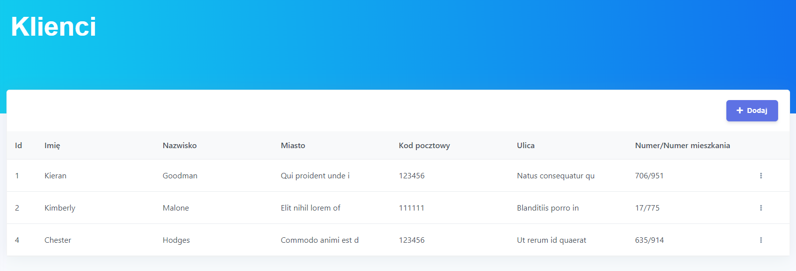
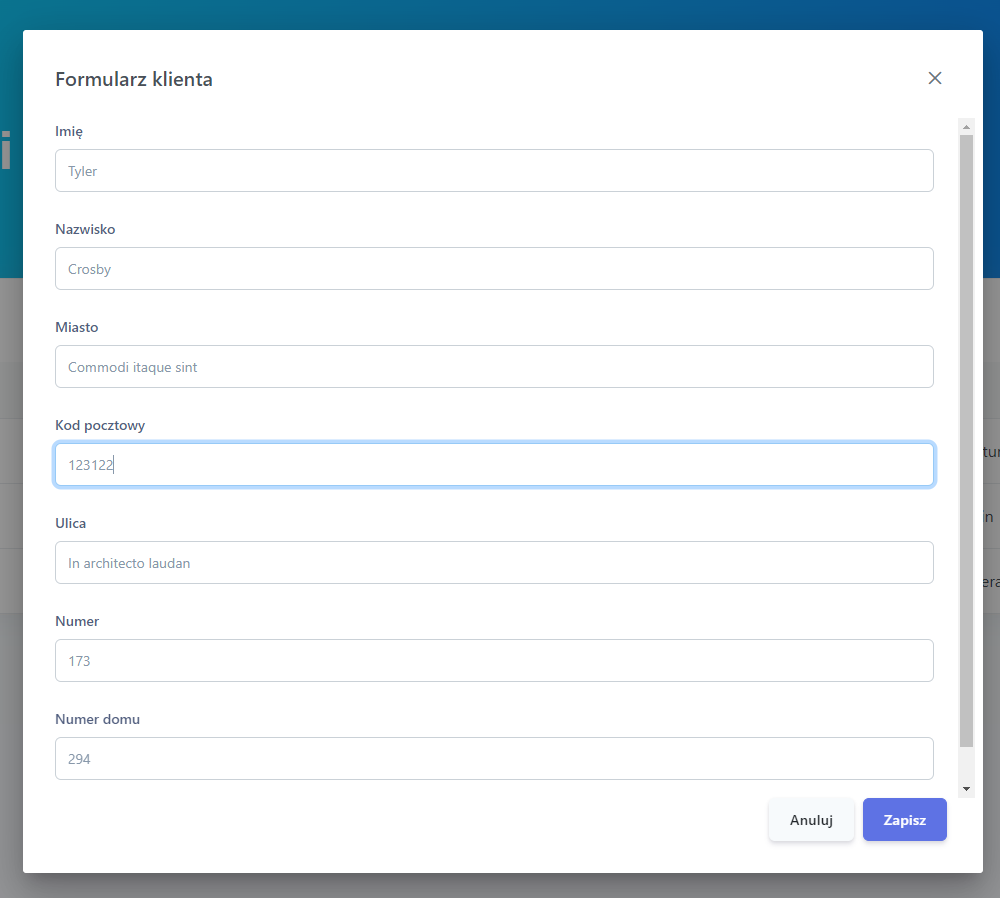
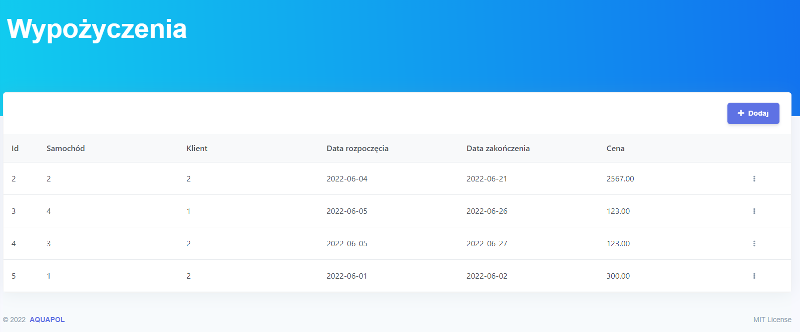
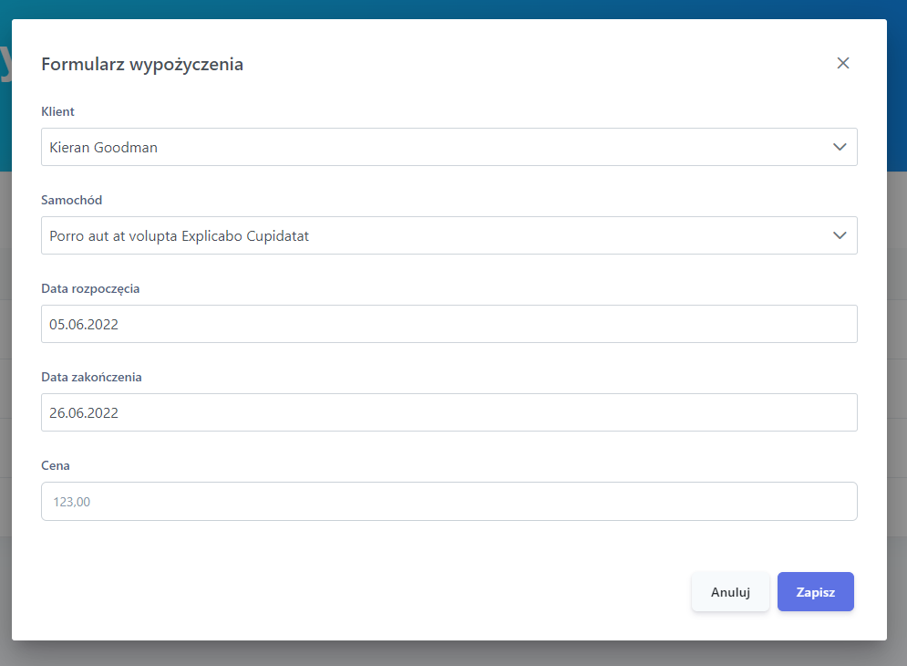

# Wypożyczalnia samochodów
Aplikacja zrealizowana przy użyciu Django Rest Framework oraz Angular 12.

Aplikacja umożliwia dodawanie, edytowanie oraz usuwanie samochodów, klientów i wypożyczeń.
Kosz końcowy wypożyczenia wyliczany jest automatycznie na podstawie dziennej stawki samochodu.

## Samochody
**Widok wszystkich samochodów**

**Formularz samochodu**

## Klienci
**Widok wszystkich klientów**

**Formularz klienta**

## Wypożyczenia
**Widok wszystkich wypożyczeń**

**Formularz wypożyczenia**
